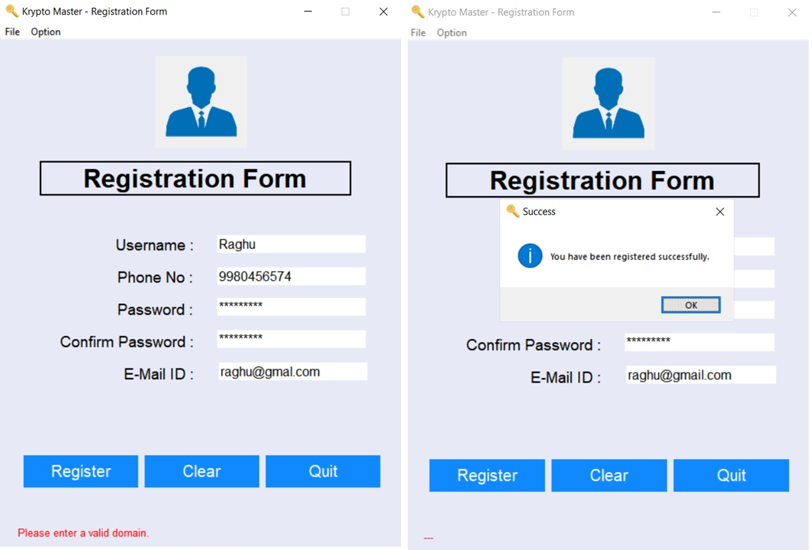
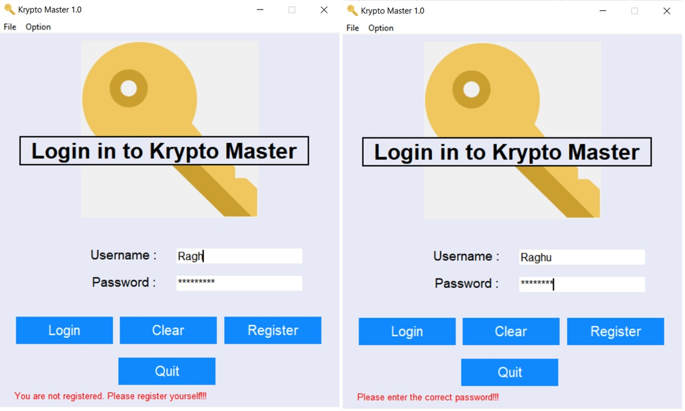

# KryptoMaster
A File Encryptor Tool (standalone application) built using Python and MySQL DBMS in which one user can encrypt/decrypt mutliple files under his/her account.

## Technology
The front-end GUI is built using TKinter module of Pyhton and for the back-end Database to store all the info, a MySQL RDBMS (MySQL Community Server 8.0.24) is used. For encrypting the contents of the files, Advanced Encryption Standard (AES) algoritm is used.

## Working
The main components of the program are:
•	GUI Windows for Login, Registration and User’s Dashboard created using Tkinter.
•	Encryption & Decryption of files through File handling.
•	Storing users’ credentials and file data in MySQL database
On successful login of a User to his/her dashboard, user can encrypt and/or decrupt multiple files.
### Encrypt: -
User can browse or enter the path to select a file to be encrypted and enter a Secret Key and on pressing the Encrypt button:
1. The file contents are encrypted
2. Details of the file is added to the user's table
3. A new file (file name is encrypted too) is created in a secure location and the encrypted data is written into it
4. The original file is deleted
### Decrypt: -
User can select a file from the list of files that he has already encrypted that has to be decrypted and enter the Secret Key and on pressing the Decrypt button:
1. The file contents are decrypted
2. A file is created in the original location and the decrypted data is written into it
3. Details of the file is deleted from the user's table
4. The encrypted file is deleted

## How to USE KryptoMaster
1. Run the below command:
```
git clone https://github.com/therealsgopi/KryptoMaster.git
```
2. Edit your MySQL DB Username and Password in the `create_database()` function which starts at `Line 61` in the file `KryptoMaster.py`.
3. Start the program by executing `KryptoMaster.py` first!

## Screenshots
### Registration Window:


### Login Window:
